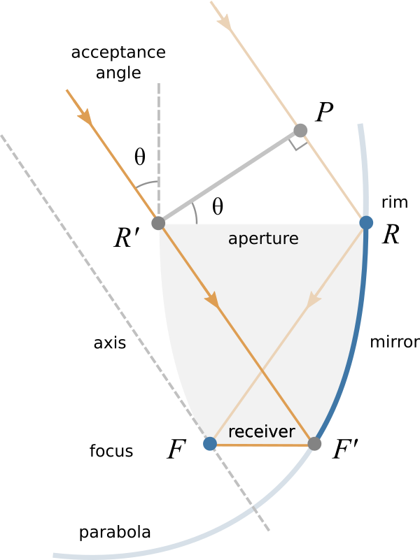

CPC
---

Compound Parabolic Concentrator 

Properties
**********

  
  
Maximal concentration

.. math::
  PR + RF = R'F' + F'F 

.. math::
  RR' \sin\theta = FF'  
  
.. math::
  C_{\rm 2D} = \frac{1}{\sin\theta}  
  
.. math::
  C_{\rm 3D} = \frac{1}{\sin^2\theta}  
  
  
Parameters
**********

| acceptance angle (theta)
| receiver radius (rR)

focal distance (f)

.. math::
  2r_{\rm R} = \frac{2f}{1 - \cos(90^\circ + \theta)} 

.. math::
  f = r_{\rm R}(1 + \sin\theta)   
  
aperture radius (rA)

.. math::
  r_{\rm A} = r_{\rm R}/\sin\theta  
  
aperture height (zA)

.. math::
  z_{\rm A} = (r_{\rm R} + r_{\rm A}) / \tan\theta  
  
center of parabola (x0, z0)

.. math::
  x_0 = f \sin\theta - r_{\rm R}  

.. math::
  z_0 = -f \cos\theta
  
bounds of parabola (uMin, uMax)

.. math::
  u_{\rm min} = 2 r_{\rm R}  \cos\theta
  
.. math::
  u_{\rm max} = \frac{2f \sin 2\theta}{1 - \cos 2\theta} 

.. math::
  u_{\rm max} = 2f/ \tan\theta
  
  
profile of parabola

.. math::
  x(u) = x_0 + u \cos\theta - \frac{u^2}{4f} \sin\theta
  
.. math::
  z(u) = z_0 + u \sin\theta + \frac{u^2}{4f} \cos\theta  