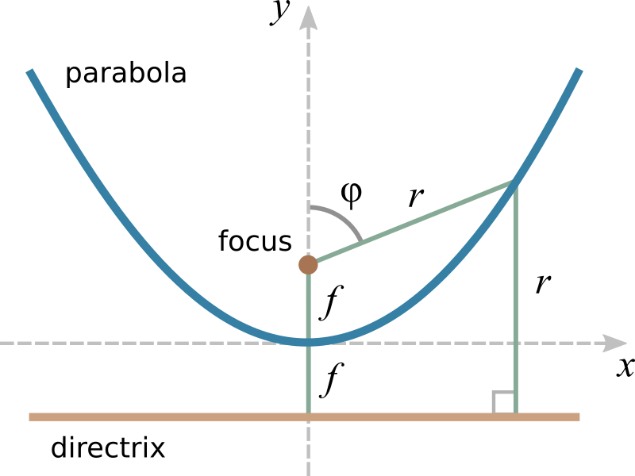
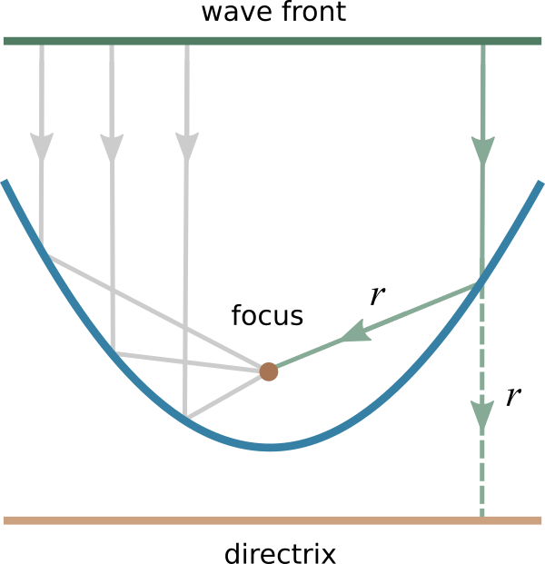
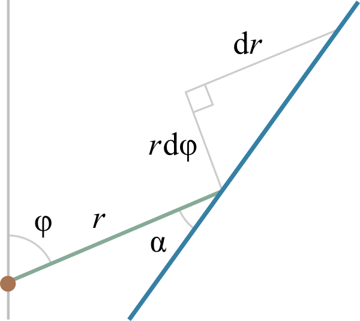

Parabola
--------

Definition
**********

  
Cartesian coordinates

.. math::
  x^2 + (y - f)^2 = (y + f)^2

.. math::
  y = \frac{x^2}{4f}

Polar coordinates

.. math::
  r = \frac{2f}{1 - \cos\varphi}
  
  
Properties
******************

Focusing by parabolic mirror

Fermat's principle (principle of least time)

Snell's law (reflection law)

  
.. math::
  \tan\alpha = \frac{r\mathrm{d}\varphi}{\mathrm{d}r} = 
  \frac{1 - \cos\varphi}{\sin\varphi} = \tan\frac{\varphi}{2}
  
Approximation by circle

.. math::
  x^2 + y^2 = R^2

.. math::
  y = \sqrt{R^2 - x^2} \approx R - \frac{x^2}{2R}

.. math::
  R = 2f
  
  
  
References
**********

https://en.wikipedia.org/wiki/Parabola